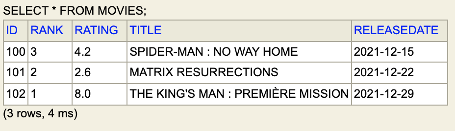

# Report Labs Cloud Integration - Thomas LACAZE DT M2 2022

Code source is available on **[Github](https://github.com/LacazeThomas/ST2DCCC)**


## Description

The application reads CSV files in order to transform them into objects and sends them to a database as well as JSON files.


## Demonstration


### Inputs

`Movie.csv`
```csv
Movie ID;Rank;Rating;Title;ReleaseDate;Actors ID
100;3;4.2;Spider-man : no way home;2021-12-15;[1,2]
101;2;2.6;Matrix Resurrections;2021-12-22;[3,1]
102;1;8.0;The King's Man : Première Mission;2021-12-29;[2,1]
```

`Actors.csv`
```
Actor ID;FirstName;LastName;BithDate;Movies ID
1;Gemma;Arterton;1986-02-02;[100,101,102]
2;Keanu;Reeves;1964-09-02;[100,102]
3;Tobey;Maguire;1975-06-27;[101]
```

### Outputs

#### H2 Database output

We can see the result of the `int-jdbc:outbound-channel-adapter` using the H2 console





#### JSON output
```json
[   
    {
        "id":1,
        "firstName":"GEMMA",
        "lastName":"ARTERTON",
        "birthDate":[1986,2,2],
        "moviesID":[100,101,102]
    },
    {
        "id":2,
        "firstName":"KEANU"
        "lastName":"REEVES",
        "birthDate":[1964,9,2],
        "moviesID":[100,102]
    },
    {
        "id":3,
        "firstName":"TOBEY",
        "lastName":"MAGUIRE",
        "birthDate":[1975,6,27],
        "moviesID":[101]
    }
]
```

## Explanation of `moviesApplication.xml`


## Problem encountered 

In order to observe the result to the database, it was necessary to be able to inspect the H2 database. 

It was necessary for that to start Spring in a classical way and to add a dependency to launch a tomcat server with annotation for XML ressource. 

Then, we had to create an 'application.properties' file in order to launch an H2 console accessible at [localhost:8080/h2-console](localhost:8080/h2-console)


`main.java`
```java
@SpringBootApplication
@ImportResource("classpath:moviesApplication.xml")
public class Main {
	public static void main(String[] args) {
		SpringApplication.run(Main.class, args);
	}
}
```

`application.properties`
```properties
spring.h2.console.enabled=true
spring.h2.console.path=/h2-console

server.port=8080
logging.level.root=DEBUG
```

## 🛠️ Installation Steps


Import the project under IntelliJ IDEA (File -> Open and select the project's folder). You can now run the program via `run` menu.


# License

**[MIT](https://github.com/LacazeThomas/ST2DCCC/blob/master/LICENSE)**